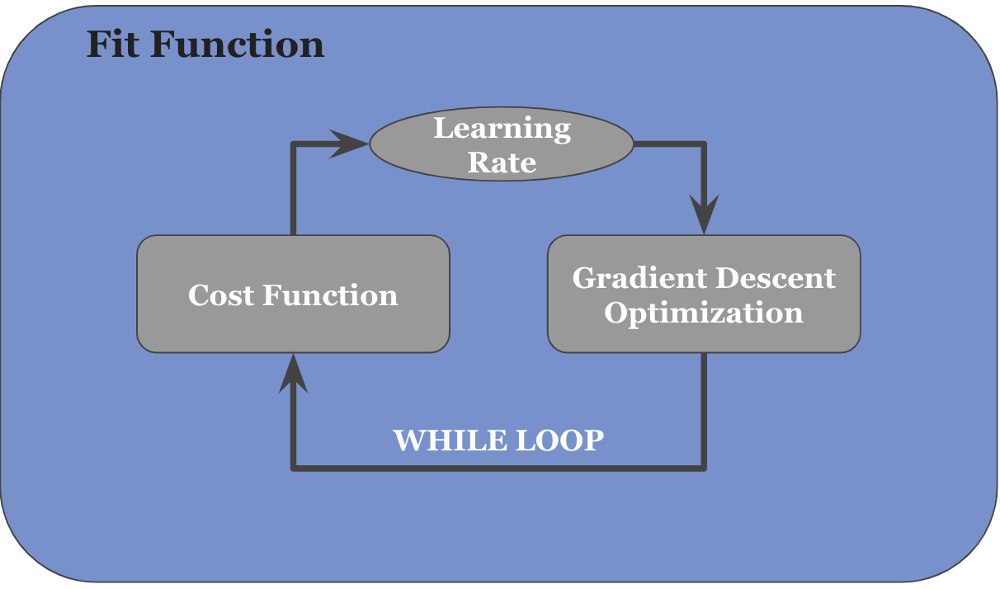

# Logistic Regression
## Prediction of Coronary Heart Disease Using Logistic Regression Binary Classifier
In this task, we utilize Logistics Regression to predict the risk of heart disease taking into consideration factors that affect cardiovascular health. According to the CDC, these factors include:
- Smoking and Secondhand Smoke Exposure
- High blood pressure
- High low-density lipoprotein (LDL) cholesterol
- Diabetes
- Obesity, unhealthy diet, and Physical inactivity

The dataset used for this analysis is obtained from the Framingham Study, which consists of 4239 surveyed individuals before data cleaning.

## Result
Using F1 score, we obtain a model accuracy of 13.5%. In a bid to improve model accuracy, we explore the following:
1. Writing the Logistics Regression from Scratch, prioritizing optimization of the regression coefficient estimates over latency:
    - The above approach led to an increase in accuracy from 13.5% to 15.1%
    - The image below shows the optimization strategy employed during development of the algorithm from scratch 
    

2. Hyperparameter: 
    - Through research and exploratory analysis, approximation threshold is reduced to 20% following findings made from the Framingham study, leading to a 185% increase in model accuracy from 13.5% t0 38.44%, and 155% increase from 15.1% to 38.44%

3. Examining Bias: 
    - Further analysis was conducted on the variables age and gender to consider their potential influence as confounders. This involved data stratification and reprocessing. Although these steps resulted in a decrease in model accuracy, it is advisable to explore the dataset for the presence of any other underlying bias, necessitating additional analysis.

## Collaborators
- Mobolaji Shobanke
- Martin Banghart
- Raffa Nimir
- Ashhwath Chandramohan
- Temiwunmi Akinmuleya
